# Airbnb Data Preparation 🏡

---


---

In this exercise, you are on your own! Load the data from Paris Airbnb listings: http://insideairbnb.com/get-the-data.html

You should be familiar with this data as we explored it in data visualization session.

The mission is to do a **complete data cleaning &amp; preparation**, and then **to fit regression model that predicts the listing price**!


```python

import pandas as pd
import numpy as np
import seaborn as sns
import matplotlib.pyplot as plt
from sklearn.model_selection import train_test_split
from sklearn.metrics import accuracy_score, r2_score
from sklearn.linear_model import LinearRegression
from sklearn.preprocessing import OneHotEncoder
from sklearn.feature_extraction.text import TfidfVectorizer
from sklearn.impute import KNNImputer
from sklearn.feature_selection import VarianceThreshold
from sklearn.preprocessing import PowerTransformer

```


```python
filepath = "/home/natsunami/Data/Datasets/listings.csv"
```


```python
df = pd.read_csv(filepath)
```

    /home/natsunami/anaconda3/lib/python3.7/site-packages/IPython/core/interactiveshell.py:3146: DtypeWarning: Columns (43,61,62) have mixed types.Specify dtype option on import or set low_memory=False.
      interactivity=interactivity, compiler=compiler, result=result)


```python
df.shape
```


    (66900, 106)


```python
df.columns
```


    Index(['id', 'listing_url', 'scrape_id', 'last_scraped', 'name', 'summary',
           'space', 'description', 'experiences_offered', 'neighborhood_overview',
           ...
           'instant_bookable', 'is_business_travel_ready', 'cancellation_policy',
           'require_guest_profile_picture', 'require_guest_phone_verification',
           'calculated_host_listings_count',
           'calculated_host_listings_count_entire_homes',
           'calculated_host_listings_count_private_rooms',
           'calculated_host_listings_count_shared_rooms', 'reviews_per_month'],
          dtype='object', length=106)


```python
df.head()
```


<div>
<style scoped>
    .dataframe tbody tr th:only-of-type {
        vertical-align: middle;
    }

    .dataframe tbody tr th {
        vertical-align: top;
    }

    .dataframe thead th {
        text-align: right;
    }
</style>
<table border="1" class="dataframe">
  <thead>
    <tr style="text-align: right;">
      <th></th>
      <th>id</th>
      <th>listing_url</th>
      <th>scrape_id</th>
      <th>last_scraped</th>
      <th>name</th>
      <th>summary</th>
      <th>space</th>
      <th>description</th>
      <th>experiences_offered</th>
      <th>neighborhood_overview</th>
      <th>...</th>
      <th>instant_bookable</th>
      <th>is_business_travel_ready</th>
      <th>cancellation_policy</th>
      <th>require_guest_profile_picture</th>
      <th>require_guest_phone_verification</th>
      <th>calculated_host_listings_count</th>
      <th>calculated_host_listings_count_entire_homes</th>
      <th>calculated_host_listings_count_private_rooms</th>
      <th>calculated_host_listings_count_shared_rooms</th>
      <th>reviews_per_month</th>
    </tr>
  </thead>
  <tbody>
    <tr>
      <th>0</th>
      <td>2577</td>
      <td>https://www.airbnb.com/rooms/2577</td>
      <td>20200510041557</td>
      <td>2020-05-12</td>
      <td>Loft for 4 by Canal Saint Martin</td>
      <td>100 m2 loft (1100 sq feet) with high ceiling, ...</td>
      <td>The district has any service or shop you may d...</td>
      <td>100 m2 loft (1100 sq feet) with high ceiling, ...</td>
      <td>none</td>
      <td>NaN</td>
      <td>...</td>
      <td>t</td>
      <td>f</td>
      <td>strict_14_with_grace_period</td>
      <td>f</td>
      <td>f</td>
      <td>1</td>
      <td>1</td>
      <td>0</td>
      <td>0</td>
      <td>0.06</td>
    </tr>
    <tr>
      <th>1</th>
      <td>3109</td>
      <td>https://www.airbnb.com/rooms/3109</td>
      <td>20200510041557</td>
      <td>2020-05-13</td>
      <td>zen and calm</td>
      <td>Appartement très calme de 50M2 Utilisation de ...</td>
      <td>I bedroom appartment in Paris 14</td>
      <td>I bedroom appartment in Paris 14 Good restaura...</td>
      <td>none</td>
      <td>Good restaurants very close the Montparnasse S...</td>
      <td>...</td>
      <td>f</td>
      <td>f</td>
      <td>flexible</td>
      <td>f</td>
      <td>f</td>
      <td>1</td>
      <td>1</td>
      <td>0</td>
      <td>0</td>
      <td>0.22</td>
    </tr>
    <tr>
      <th>2</th>
      <td>5396</td>
      <td>https://www.airbnb.com/rooms/5396</td>
      <td>20200510041557</td>
      <td>2020-05-13</td>
      <td>Explore the heart of old Paris</td>
      <td>Cozy, well-appointed and graciously designed s...</td>
      <td>Small, well appointed studio apartment at the ...</td>
      <td>Cozy, well-appointed and graciously designed s...</td>
      <td>none</td>
      <td>You are within walking distance to the Louvre,...</td>
      <td>...</td>
      <td>t</td>
      <td>f</td>
      <td>strict_14_with_grace_period</td>
      <td>f</td>
      <td>f</td>
      <td>1</td>
      <td>1</td>
      <td>0</td>
      <td>0</td>
      <td>1.66</td>
    </tr>
    <tr>
      <th>3</th>
      <td>7397</td>
      <td>https://www.airbnb.com/rooms/7397</td>
      <td>20200510041557</td>
      <td>2020-05-13</td>
      <td>MARAIS - 2ROOMS APT - 2/4 PEOPLE</td>
      <td>VERY CONVENIENT, WITH THE BEST LOCATION !</td>
      <td>PLEASE ASK ME BEFORE TO MAKE A REQUEST !!! No ...</td>
      <td>VERY CONVENIENT, WITH THE BEST LOCATION ! PLEA...</td>
      <td>none</td>
      <td>NaN</td>
      <td>...</td>
      <td>f</td>
      <td>f</td>
      <td>moderate</td>
      <td>f</td>
      <td>f</td>
      <td>5</td>
      <td>5</td>
      <td>0</td>
      <td>0</td>
      <td>2.42</td>
    </tr>
    <tr>
      <th>4</th>
      <td>7964</td>
      <td>https://www.airbnb.com/rooms/7964</td>
      <td>20200510041557</td>
      <td>2020-05-12</td>
      <td>Large &amp; sunny flat with balcony !</td>
      <td>Very large &amp; nice apartment all for you!  - Su...</td>
      <td>hello ! We have a great 75 square meter apartm...</td>
      <td>Very large &amp; nice apartment all for you!  - Su...</td>
      <td>none</td>
      <td>NaN</td>
      <td>...</td>
      <td>f</td>
      <td>f</td>
      <td>strict_14_with_grace_period</td>
      <td>f</td>
      <td>f</td>
      <td>1</td>
      <td>1</td>
      <td>0</td>
      <td>0</td>
      <td>0.05</td>
    </tr>
  </tbody>
</table>
<p>5 rows × 106 columns</p>
</div>


```python
df.columns
```


    Index(['id', 'listing_url', 'scrape_id', 'last_scraped', 'name', 'summary',
           'space', 'description', 'experiences_offered', 'neighborhood_overview',
           ...
           'instant_bookable', 'is_business_travel_ready', 'cancellation_policy',
           'require_guest_profile_picture', 'require_guest_phone_verification',
           'calculated_host_listings_count',
           'calculated_host_listings_count_entire_homes',
           'calculated_host_listings_count_private_rooms',
           'calculated_host_listings_count_shared_rooms', 'reviews_per_month'],
          dtype='object', length=106)


```python
# We remove columns with 30% of Nan values:
mask_nan = df.isna().sum()/len(df) < 0.3
```


```python
df_nan_masked = df.loc[:, mask_nan]
```


```python
df_nan_masked.head()
```


<div>
<style scoped>
    .dataframe tbody tr th:only-of-type {
        vertical-align: middle;
    }

    .dataframe tbody tr th {
        vertical-align: top;
    }

    .dataframe thead th {
        text-align: right;
    }
</style>
<table border="1" class="dataframe">
  <thead>
    <tr style="text-align: right;">
      <th></th>
      <th>id</th>
      <th>listing_url</th>
      <th>scrape_id</th>
      <th>last_scraped</th>
      <th>name</th>
      <th>summary</th>
      <th>space</th>
      <th>description</th>
      <th>experiences_offered</th>
      <th>picture_url</th>
      <th>...</th>
      <th>instant_bookable</th>
      <th>is_business_travel_ready</th>
      <th>cancellation_policy</th>
      <th>require_guest_profile_picture</th>
      <th>require_guest_phone_verification</th>
      <th>calculated_host_listings_count</th>
      <th>calculated_host_listings_count_entire_homes</th>
      <th>calculated_host_listings_count_private_rooms</th>
      <th>calculated_host_listings_count_shared_rooms</th>
      <th>reviews_per_month</th>
    </tr>
  </thead>
  <tbody>
    <tr>
      <th>0</th>
      <td>2577</td>
      <td>https://www.airbnb.com/rooms/2577</td>
      <td>20200510041557</td>
      <td>2020-05-12</td>
      <td>Loft for 4 by Canal Saint Martin</td>
      <td>100 m2 loft (1100 sq feet) with high ceiling, ...</td>
      <td>The district has any service or shop you may d...</td>
      <td>100 m2 loft (1100 sq feet) with high ceiling, ...</td>
      <td>none</td>
      <td>https://a0.muscache.com/im/pictures/09da057c-0...</td>
      <td>...</td>
      <td>t</td>
      <td>f</td>
      <td>strict_14_with_grace_period</td>
      <td>f</td>
      <td>f</td>
      <td>1</td>
      <td>1</td>
      <td>0</td>
      <td>0</td>
      <td>0.06</td>
    </tr>
    <tr>
      <th>1</th>
      <td>3109</td>
      <td>https://www.airbnb.com/rooms/3109</td>
      <td>20200510041557</td>
      <td>2020-05-13</td>
      <td>zen and calm</td>
      <td>Appartement très calme de 50M2 Utilisation de ...</td>
      <td>I bedroom appartment in Paris 14</td>
      <td>I bedroom appartment in Paris 14 Good restaura...</td>
      <td>none</td>
      <td>https://a0.muscache.com/im/pictures/baeae9e2-c...</td>
      <td>...</td>
      <td>f</td>
      <td>f</td>
      <td>flexible</td>
      <td>f</td>
      <td>f</td>
      <td>1</td>
      <td>1</td>
      <td>0</td>
      <td>0</td>
      <td>0.22</td>
    </tr>
    <tr>
      <th>2</th>
      <td>5396</td>
      <td>https://www.airbnb.com/rooms/5396</td>
      <td>20200510041557</td>
      <td>2020-05-13</td>
      <td>Explore the heart of old Paris</td>
      <td>Cozy, well-appointed and graciously designed s...</td>
      <td>Small, well appointed studio apartment at the ...</td>
      <td>Cozy, well-appointed and graciously designed s...</td>
      <td>none</td>
      <td>https://a0.muscache.com/im/pictures/52413/f9bf...</td>
      <td>...</td>
      <td>t</td>
      <td>f</td>
      <td>strict_14_with_grace_period</td>
      <td>f</td>
      <td>f</td>
      <td>1</td>
      <td>1</td>
      <td>0</td>
      <td>0</td>
      <td>1.66</td>
    </tr>
    <tr>
      <th>3</th>
      <td>7397</td>
      <td>https://www.airbnb.com/rooms/7397</td>
      <td>20200510041557</td>
      <td>2020-05-13</td>
      <td>MARAIS - 2ROOMS APT - 2/4 PEOPLE</td>
      <td>VERY CONVENIENT, WITH THE BEST LOCATION !</td>
      <td>PLEASE ASK ME BEFORE TO MAKE A REQUEST !!! No ...</td>
      <td>VERY CONVENIENT, WITH THE BEST LOCATION ! PLEA...</td>
      <td>none</td>
      <td>https://a0.muscache.com/im/pictures/67928287/3...</td>
      <td>...</td>
      <td>f</td>
      <td>f</td>
      <td>moderate</td>
      <td>f</td>
      <td>f</td>
      <td>5</td>
      <td>5</td>
      <td>0</td>
      <td>0</td>
      <td>2.42</td>
    </tr>
    <tr>
      <th>4</th>
      <td>7964</td>
      <td>https://www.airbnb.com/rooms/7964</td>
      <td>20200510041557</td>
      <td>2020-05-12</td>
      <td>Large &amp; sunny flat with balcony !</td>
      <td>Very large &amp; nice apartment all for you!  - Su...</td>
      <td>hello ! We have a great 75 square meter apartm...</td>
      <td>Very large &amp; nice apartment all for you!  - Su...</td>
      <td>none</td>
      <td>https://a0.muscache.com/im/pictures/4471349/6f...</td>
      <td>...</td>
      <td>f</td>
      <td>f</td>
      <td>strict_14_with_grace_period</td>
      <td>f</td>
      <td>f</td>
      <td>1</td>
      <td>1</td>
      <td>0</td>
      <td>0</td>
      <td>0.05</td>
    </tr>
  </tbody>
</table>
<p>5 rows × 88 columns</p>
</div>


```python
# Looking for duplicated data based on the 'id' column:
df_nan_masked[df_nan_masked.duplicated(subset='id',keep=False)]
```


<div>
<style scoped>
    .dataframe tbody tr th:only-of-type {
        vertical-align: middle;
    }

    .dataframe tbody tr th {
        vertical-align: top;
    }

    .dataframe thead th {
        text-align: right;
    }
</style>
<table border="1" class="dataframe">
  <thead>
    <tr style="text-align: right;">
      <th></th>
      <th>id</th>
      <th>listing_url</th>
      <th>scrape_id</th>
      <th>last_scraped</th>
      <th>name</th>
      <th>summary</th>
      <th>space</th>
      <th>description</th>
      <th>experiences_offered</th>
      <th>picture_url</th>
      <th>...</th>
      <th>instant_bookable</th>
      <th>is_business_travel_ready</th>
      <th>cancellation_policy</th>
      <th>require_guest_profile_picture</th>
      <th>require_guest_phone_verification</th>
      <th>calculated_host_listings_count</th>
      <th>calculated_host_listings_count_entire_homes</th>
      <th>calculated_host_listings_count_private_rooms</th>
      <th>calculated_host_listings_count_shared_rooms</th>
      <th>reviews_per_month</th>
    </tr>
  </thead>
  <tbody>
  </tbody>
</table>
<p>0 rows × 88 columns</p>
</div>


```python
# We split the data according to type ( number / not number):
df_not_numb = df_nan_masked.select_dtypes(exclude=['int','float'])
df_numb = df_nan_masked.select_dtypes(include=['int','float'])
```


```python
# Shape of the two DataFrame:
df_not_numb.shape, df_numb.shape
```


    ((66900, 50), (66900, 38))


```python
#We remove useless text/category column useless for the .regression:
df_not_numb.head()
```


<div>
<style scoped>
    .dataframe tbody tr th:only-of-type {
        vertical-align: middle;
    }

    .dataframe tbody tr th {
        vertical-align: top;
    }

    .dataframe thead th {
        text-align: right;
    }
</style>
<table border="1" class="dataframe">
  <thead>
    <tr style="text-align: right;">
      <th></th>
      <th>listing_url</th>
      <th>last_scraped</th>
      <th>name</th>
      <th>summary</th>
      <th>space</th>
      <th>description</th>
      <th>experiences_offered</th>
      <th>picture_url</th>
      <th>host_url</th>
      <th>host_name</th>
      <th>...</th>
      <th>calendar_last_scraped</th>
      <th>first_review</th>
      <th>last_review</th>
      <th>requires_license</th>
      <th>jurisdiction_names</th>
      <th>instant_bookable</th>
      <th>is_business_travel_ready</th>
      <th>cancellation_policy</th>
      <th>require_guest_profile_picture</th>
      <th>require_guest_phone_verification</th>
    </tr>
  </thead>
  <tbody>
    <tr>
      <th>0</th>
      <td>https://www.airbnb.com/rooms/2577</td>
      <td>2020-05-12</td>
      <td>Loft for 4 by Canal Saint Martin</td>
      <td>100 m2 loft (1100 sq feet) with high ceiling, ...</td>
      <td>The district has any service or shop you may d...</td>
      <td>100 m2 loft (1100 sq feet) with high ceiling, ...</td>
      <td>none</td>
      <td>https://a0.muscache.com/im/pictures/09da057c-0...</td>
      <td>https://www.airbnb.com/users/show/2827</td>
      <td>Karine</td>
      <td>...</td>
      <td>2020-05-12</td>
      <td>2019-01-02</td>
      <td>2019-01-02</td>
      <td>t</td>
      <td>{"translation missing: en.occupancy.taxes.juri...</td>
      <td>t</td>
      <td>f</td>
      <td>strict_14_with_grace_period</td>
      <td>f</td>
      <td>f</td>
    </tr>
    <tr>
      <th>1</th>
      <td>https://www.airbnb.com/rooms/3109</td>
      <td>2020-05-13</td>
      <td>zen and calm</td>
      <td>Appartement très calme de 50M2 Utilisation de ...</td>
      <td>I bedroom appartment in Paris 14</td>
      <td>I bedroom appartment in Paris 14 Good restaura...</td>
      <td>none</td>
      <td>https://a0.muscache.com/im/pictures/baeae9e2-c...</td>
      <td>https://www.airbnb.com/users/show/3631</td>
      <td>Anne</td>
      <td>...</td>
      <td>2020-05-13</td>
      <td>2016-12-27</td>
      <td>2019-10-24</td>
      <td>t</td>
      <td>{"translation missing: en.occupancy.taxes.juri...</td>
      <td>f</td>
      <td>f</td>
      <td>flexible</td>
      <td>f</td>
      <td>f</td>
    </tr>
    <tr>
      <th>2</th>
      <td>https://www.airbnb.com/rooms/5396</td>
      <td>2020-05-13</td>
      <td>Explore the heart of old Paris</td>
      <td>Cozy, well-appointed and graciously designed s...</td>
      <td>Small, well appointed studio apartment at the ...</td>
      <td>Cozy, well-appointed and graciously designed s...</td>
      <td>none</td>
      <td>https://a0.muscache.com/im/pictures/52413/f9bf...</td>
      <td>https://www.airbnb.com/users/show/7903</td>
      <td>Borzou</td>
      <td>...</td>
      <td>2020-05-13</td>
      <td>2009-06-30</td>
      <td>2020-03-22</td>
      <td>t</td>
      <td>{"translation missing: en.occupancy.taxes.juri...</td>
      <td>t</td>
      <td>f</td>
      <td>strict_14_with_grace_period</td>
      <td>f</td>
      <td>f</td>
    </tr>
    <tr>
      <th>3</th>
      <td>https://www.airbnb.com/rooms/7397</td>
      <td>2020-05-13</td>
      <td>MARAIS - 2ROOMS APT - 2/4 PEOPLE</td>
      <td>VERY CONVENIENT, WITH THE BEST LOCATION !</td>
      <td>PLEASE ASK ME BEFORE TO MAKE A REQUEST !!! No ...</td>
      <td>VERY CONVENIENT, WITH THE BEST LOCATION ! PLEA...</td>
      <td>none</td>
      <td>https://a0.muscache.com/im/pictures/67928287/3...</td>
      <td>https://www.airbnb.com/users/show/2626</td>
      <td>Franck</td>
      <td>...</td>
      <td>2020-05-13</td>
      <td>2011-04-08</td>
      <td>2020-02-26</td>
      <td>t</td>
      <td>{"translation missing: en.occupancy.taxes.juri...</td>
      <td>f</td>
      <td>f</td>
      <td>moderate</td>
      <td>f</td>
      <td>f</td>
    </tr>
    <tr>
      <th>4</th>
      <td>https://www.airbnb.com/rooms/7964</td>
      <td>2020-05-12</td>
      <td>Large &amp; sunny flat with balcony !</td>
      <td>Very large &amp; nice apartment all for you!  - Su...</td>
      <td>hello ! We have a great 75 square meter apartm...</td>
      <td>Very large &amp; nice apartment all for you!  - Su...</td>
      <td>none</td>
      <td>https://a0.muscache.com/im/pictures/4471349/6f...</td>
      <td>https://www.airbnb.com/users/show/22155</td>
      <td>Anaïs</td>
      <td>...</td>
      <td>2020-05-12</td>
      <td>2010-05-10</td>
      <td>2015-09-14</td>
      <td>t</td>
      <td>{"translation missing: en.occupancy.taxes.juri...</td>
      <td>f</td>
      <td>f</td>
      <td>strict_14_with_grace_period</td>
      <td>f</td>
      <td>f</td>
    </tr>
  </tbody>
</table>
<p>5 rows × 50 columns</p>
</div>


```python
df_not_numb.columns
```


    Index(['listing_url', 'last_scraped', 'name', 'summary', 'space',
           'description', 'experiences_offered', 'picture_url', 'host_url',
           'host_name', 'host_since', 'host_location', 'host_is_superhost',
           'host_thumbnail_url', 'host_picture_url', 'host_neighbourhood',
           'host_verifications', 'host_has_profile_pic', 'host_identity_verified',
           'street', 'neighbourhood', 'neighbourhood_cleansed', 'city', 'state',
           'zipcode', 'market', 'smart_location', 'country_code', 'country',
           'is_location_exact', 'property_type', 'room_type', 'bed_type',
           'amenities', 'price', 'security_deposit', 'cleaning_fee',
           'extra_people', 'calendar_updated', 'has_availability',
           'calendar_last_scraped', 'first_review', 'last_review',
           'requires_license', 'jurisdiction_names', 'instant_bookable',
           'is_business_travel_ready', 'cancellation_policy',
           'require_guest_profile_picture', 'require_guest_phone_verification'],
          dtype='object')


```python
useless_text_col = ['listing_url', 'last_scraped', 'summary', 'space','experiences_offered', 'picture_url', 'host_url','host_name', 'host_since', 'host_location','calendar_last_scraped', 'first_review', 'last_review','requires_license', 'jurisdiction_names','require_guest_profile_picture', 'require_guest_phone_verification']
```


```python
df_not_numb_drop1 = df_not_numb.drop(useless_text_col, axis= 1)
```


```python
df_not_numb_drop1.head()
```


<div>
<style scoped>
    .dataframe tbody tr th:only-of-type {
        vertical-align: middle;
    }

    .dataframe tbody tr th {
        vertical-align: top;
    }

    .dataframe thead th {
        text-align: right;
    }
</style>
<table border="1" class="dataframe">
  <thead>
    <tr style="text-align: right;">
      <th></th>
      <th>name</th>
      <th>description</th>
      <th>host_is_superhost</th>
      <th>host_thumbnail_url</th>
      <th>host_picture_url</th>
      <th>host_neighbourhood</th>
      <th>host_verifications</th>
      <th>host_has_profile_pic</th>
      <th>host_identity_verified</th>
      <th>street</th>
      <th>...</th>
      <th>amenities</th>
      <th>price</th>
      <th>security_deposit</th>
      <th>cleaning_fee</th>
      <th>extra_people</th>
      <th>calendar_updated</th>
      <th>has_availability</th>
      <th>instant_bookable</th>
      <th>is_business_travel_ready</th>
      <th>cancellation_policy</th>
    </tr>
  </thead>
  <tbody>
    <tr>
      <th>0</th>
      <td>Loft for 4 by Canal Saint Martin</td>
      <td>100 m2 loft (1100 sq feet) with high ceiling, ...</td>
      <td>f</td>
      <td>https://a0.muscache.com/im/pictures/user/17fe6...</td>
      <td>https://a0.muscache.com/im/pictures/user/17fe6...</td>
      <td>République</td>
      <td>['email', 'phone', 'reviews', 'jumio', 'govern...</td>
      <td>t</td>
      <td>t</td>
      <td>Paris, Île-de-France, France</td>
      <td>...</td>
      <td>{TV,Internet,Wifi,Kitchen,Heating,Washer,Dryer...</td>
      <td>$125.00</td>
      <td>$0.00</td>
      <td>$40.00</td>
      <td>$0.00</td>
      <td>18 months ago</td>
      <td>t</td>
      <td>t</td>
      <td>f</td>
      <td>strict_14_with_grace_period</td>
    </tr>
    <tr>
      <th>1</th>
      <td>zen and calm</td>
      <td>I bedroom appartment in Paris 14 Good restaura...</td>
      <td>f</td>
      <td>https://a0.muscache.com/im/users/3631/profile_...</td>
      <td>https://a0.muscache.com/im/users/3631/profile_...</td>
      <td>Alésia</td>
      <td>['email', 'phone', 'facebook', 'reviews']</td>
      <td>t</td>
      <td>f</td>
      <td>Paris, Île-de-France, France</td>
      <td>...</td>
      <td>{Internet,Wifi,Kitchen,"Paid parking off premi...</td>
      <td>$60.00</td>
      <td>$150.00</td>
      <td>$60.00</td>
      <td>$0.00</td>
      <td>3 months ago</td>
      <td>t</td>
      <td>f</td>
      <td>f</td>
      <td>flexible</td>
    </tr>
    <tr>
      <th>2</th>
      <td>Explore the heart of old Paris</td>
      <td>Cozy, well-appointed and graciously designed s...</td>
      <td>f</td>
      <td>https://a0.muscache.com/im/users/7903/profile_...</td>
      <td>https://a0.muscache.com/im/users/7903/profile_...</td>
      <td>Saint-Paul - Ile Saint-Louis</td>
      <td>['email', 'phone', 'facebook', 'google', 'revi...</td>
      <td>t</td>
      <td>t</td>
      <td>Paris, Ile-de-France, France</td>
      <td>...</td>
      <td>{Internet,Wifi,Kitchen,Heating,Washer,"Smoke d...</td>
      <td>$115.00</td>
      <td>$0.00</td>
      <td>$36.00</td>
      <td>$0.00</td>
      <td>6 weeks ago</td>
      <td>t</td>
      <td>t</td>
      <td>f</td>
      <td>strict_14_with_grace_period</td>
    </tr>
    <tr>
      <th>3</th>
      <td>MARAIS - 2ROOMS APT - 2/4 PEOPLE</td>
      <td>VERY CONVENIENT, WITH THE BEST LOCATION ! PLEA...</td>
      <td>t</td>
      <td>https://a0.muscache.com/im/pictures/user/58f00...</td>
      <td>https://a0.muscache.com/im/pictures/user/58f00...</td>
      <td>Le Marais</td>
      <td>['email', 'phone', 'reviews', 'jumio', 'offlin...</td>
      <td>t</td>
      <td>t</td>
      <td>Paris, Île-de-France, France</td>
      <td>...</td>
      <td>{TV,"Cable TV",Internet,Wifi,Kitchen,"Paid par...</td>
      <td>$119.00</td>
      <td>$200.00</td>
      <td>$50.00</td>
      <td>$10.00</td>
      <td>a week ago</td>
      <td>t</td>
      <td>f</td>
      <td>f</td>
      <td>moderate</td>
    </tr>
    <tr>
      <th>4</th>
      <td>Large &amp; sunny flat with balcony !</td>
      <td>Very large &amp; nice apartment all for you!  - Su...</td>
      <td>f</td>
      <td>https://a0.muscache.com/im/users/22155/profile...</td>
      <td>https://a0.muscache.com/im/users/22155/profile...</td>
      <td>Gare du Nord - Gare de I'Est</td>
      <td>['email', 'phone', 'reviews', 'jumio', 'offlin...</td>
      <td>t</td>
      <td>t</td>
      <td>Paris, Île-de-France, France</td>
      <td>...</td>
      <td>{TV,"Cable TV",Internet,Wifi,Kitchen,"Buzzer/w...</td>
      <td>$130.00</td>
      <td>$500.00</td>
      <td>$60.00</td>
      <td>$20.00</td>
      <td>4 months ago</td>
      <td>t</td>
      <td>f</td>
      <td>f</td>
      <td>strict_14_with_grace_period</td>
    </tr>
  </tbody>
</table>
<p>5 rows × 33 columns</p>
</div>


```python
df_not_numb_drop1.columns
```


    Index(['name', 'description', 'host_is_superhost', 'host_thumbnail_url',
           'host_picture_url', 'host_neighbourhood', 'host_verifications',
           'host_has_profile_pic', 'host_identity_verified', 'street',
           'neighbourhood', 'neighbourhood_cleansed', 'city', 'state', 'zipcode',
           'market', 'smart_location', 'country_code', 'country',
           'is_location_exact', 'property_type', 'room_type', 'bed_type',
           'amenities', 'price', 'security_deposit', 'cleaning_fee',
           'extra_people', 'calendar_updated', 'has_availability',
           'instant_bookable', 'is_business_travel_ready', 'cancellation_policy'],
          dtype='object')


```python
useless_text_col2 = ['host_thumbnail_url','host_picture_url','host_verifications','host_has_profile_pic', 'host_identity_verified','amenities','extra_people','calendar_updated', 'has_availability']
```


```python
df_not_numb_drop2 = df_not_numb_drop1.drop(useless_text_col2, axis= 1)
```


```python
df_not_numb_drop2.head()
```


<div>
<style scoped>
    .dataframe tbody tr th:only-of-type {
        vertical-align: middle;
    }

    .dataframe tbody tr th {
        vertical-align: top;
    }

    .dataframe thead th {
        text-align: right;
    }
</style>
<table border="1" class="dataframe">
  <thead>
    <tr style="text-align: right;">
      <th></th>
      <th>name</th>
      <th>description</th>
      <th>host_is_superhost</th>
      <th>host_neighbourhood</th>
      <th>street</th>
      <th>neighbourhood</th>
      <th>neighbourhood_cleansed</th>
      <th>city</th>
      <th>state</th>
      <th>zipcode</th>
      <th>...</th>
      <th>is_location_exact</th>
      <th>property_type</th>
      <th>room_type</th>
      <th>bed_type</th>
      <th>price</th>
      <th>security_deposit</th>
      <th>cleaning_fee</th>
      <th>instant_bookable</th>
      <th>is_business_travel_ready</th>
      <th>cancellation_policy</th>
    </tr>
  </thead>
  <tbody>
    <tr>
      <th>0</th>
      <td>Loft for 4 by Canal Saint Martin</td>
      <td>100 m2 loft (1100 sq feet) with high ceiling, ...</td>
      <td>f</td>
      <td>République</td>
      <td>Paris, Île-de-France, France</td>
      <td>République</td>
      <td>Entrepôt</td>
      <td>Paris</td>
      <td>Île-de-France</td>
      <td>75010</td>
      <td>...</td>
      <td>t</td>
      <td>Loft</td>
      <td>Entire home/apt</td>
      <td>Real Bed</td>
      <td>$125.00</td>
      <td>$0.00</td>
      <td>$40.00</td>
      <td>t</td>
      <td>f</td>
      <td>strict_14_with_grace_period</td>
    </tr>
    <tr>
      <th>1</th>
      <td>zen and calm</td>
      <td>I bedroom appartment in Paris 14 Good restaura...</td>
      <td>f</td>
      <td>Alésia</td>
      <td>Paris, Île-de-France, France</td>
      <td>Alésia</td>
      <td>Observatoire</td>
      <td>Paris</td>
      <td>Île-de-France</td>
      <td>75014</td>
      <td>...</td>
      <td>f</td>
      <td>Apartment</td>
      <td>Entire home/apt</td>
      <td>Real Bed</td>
      <td>$60.00</td>
      <td>$150.00</td>
      <td>$60.00</td>
      <td>f</td>
      <td>f</td>
      <td>flexible</td>
    </tr>
    <tr>
      <th>2</th>
      <td>Explore the heart of old Paris</td>
      <td>Cozy, well-appointed and graciously designed s...</td>
      <td>f</td>
      <td>Saint-Paul - Ile Saint-Louis</td>
      <td>Paris, Ile-de-France, France</td>
      <td>IV Arrondissement</td>
      <td>Hôtel-de-Ville</td>
      <td>Paris</td>
      <td>Ile-de-France</td>
      <td>75004</td>
      <td>...</td>
      <td>t</td>
      <td>Apartment</td>
      <td>Entire home/apt</td>
      <td>Pull-out Sofa</td>
      <td>$115.00</td>
      <td>$0.00</td>
      <td>$36.00</td>
      <td>t</td>
      <td>f</td>
      <td>strict_14_with_grace_period</td>
    </tr>
    <tr>
      <th>3</th>
      <td>MARAIS - 2ROOMS APT - 2/4 PEOPLE</td>
      <td>VERY CONVENIENT, WITH THE BEST LOCATION ! PLEA...</td>
      <td>t</td>
      <td>Le Marais</td>
      <td>Paris, Île-de-France, France</td>
      <td>IV Arrondissement</td>
      <td>Hôtel-de-Ville</td>
      <td>Paris</td>
      <td>Île-de-France</td>
      <td>75004</td>
      <td>...</td>
      <td>t</td>
      <td>Apartment</td>
      <td>Entire home/apt</td>
      <td>Real Bed</td>
      <td>$119.00</td>
      <td>$200.00</td>
      <td>$50.00</td>
      <td>f</td>
      <td>f</td>
      <td>moderate</td>
    </tr>
    <tr>
      <th>4</th>
      <td>Large &amp; sunny flat with balcony !</td>
      <td>Very large &amp; nice apartment all for you!  - Su...</td>
      <td>f</td>
      <td>Gare du Nord - Gare de I'Est</td>
      <td>Paris, Île-de-France, France</td>
      <td>IX Arrondissement</td>
      <td>Opéra</td>
      <td>Paris</td>
      <td>Île-de-France</td>
      <td>75009</td>
      <td>...</td>
      <td>t</td>
      <td>Apartment</td>
      <td>Entire home/apt</td>
      <td>Real Bed</td>
      <td>$130.00</td>
      <td>$500.00</td>
      <td>$60.00</td>
      <td>f</td>
      <td>f</td>
      <td>strict_14_with_grace_period</td>
    </tr>
  </tbody>
</table>
<p>5 rows × 24 columns</p>
</div>


```python
df['country_code'].unique()
```


    array(['FR', 'CH', 'CM'], dtype=object)


```python
df_not_numb_drop2.columns
```


    Index(['name', 'description', 'host_is_superhost', 'host_neighbourhood',
           'street', 'neighbourhood', 'neighbourhood_cleansed', 'city', 'state',
           'zipcode', 'market', 'smart_location', 'country_code', 'country',
           'is_location_exact', 'property_type', 'room_type', 'bed_type', 'price',
           'security_deposit', 'cleaning_fee', 'instant_bookable',
           'is_business_travel_ready', 'cancellation_policy'],
          dtype='object')


```python
useless_text_col3 = ['street','neighbourhood','neighbourhood_cleansed','city','state','market','smart_location','country_code','country','is_location_exact','is_business_travel_ready']
```


```python
df_not_numb_drop3 = df_not_numb_drop2.drop(useless_text_col3, axis= 1)
```


```python
df_not_numb_drop3.columns
```


    Index(['name', 'description', 'host_is_superhost', 'host_neighbourhood',
           'zipcode', 'property_type', 'room_type', 'bed_type', 'price',
           'security_deposit', 'cleaning_fee', 'instant_bookable',
           'cancellation_policy'],
          dtype='object')


```python
df_not_numb_drop3.head()
```


<div>
<style scoped>
    .dataframe tbody tr th:only-of-type {
        vertical-align: middle;
    }

    .dataframe tbody tr th {
        vertical-align: top;
    }

    .dataframe thead th {
        text-align: right;
    }
</style>
<table border="1" class="dataframe">
  <thead>
    <tr style="text-align: right;">
      <th></th>
      <th>name</th>
      <th>description</th>
      <th>host_is_superhost</th>
      <th>host_neighbourhood</th>
      <th>zipcode</th>
      <th>property_type</th>
      <th>room_type</th>
      <th>bed_type</th>
      <th>price</th>
      <th>security_deposit</th>
      <th>cleaning_fee</th>
      <th>instant_bookable</th>
      <th>cancellation_policy</th>
    </tr>
  </thead>
  <tbody>
    <tr>
      <th>0</th>
      <td>Loft for 4 by Canal Saint Martin</td>
      <td>100 m2 loft (1100 sq feet) with high ceiling, ...</td>
      <td>f</td>
      <td>République</td>
      <td>75010</td>
      <td>Loft</td>
      <td>Entire home/apt</td>
      <td>Real Bed</td>
      <td>$125.00</td>
      <td>$0.00</td>
      <td>$40.00</td>
      <td>t</td>
      <td>strict_14_with_grace_period</td>
    </tr>
    <tr>
      <th>1</th>
      <td>zen and calm</td>
      <td>I bedroom appartment in Paris 14 Good restaura...</td>
      <td>f</td>
      <td>Alésia</td>
      <td>75014</td>
      <td>Apartment</td>
      <td>Entire home/apt</td>
      <td>Real Bed</td>
      <td>$60.00</td>
      <td>$150.00</td>
      <td>$60.00</td>
      <td>f</td>
      <td>flexible</td>
    </tr>
    <tr>
      <th>2</th>
      <td>Explore the heart of old Paris</td>
      <td>Cozy, well-appointed and graciously designed s...</td>
      <td>f</td>
      <td>Saint-Paul - Ile Saint-Louis</td>
      <td>75004</td>
      <td>Apartment</td>
      <td>Entire home/apt</td>
      <td>Pull-out Sofa</td>
      <td>$115.00</td>
      <td>$0.00</td>
      <td>$36.00</td>
      <td>t</td>
      <td>strict_14_with_grace_period</td>
    </tr>
    <tr>
      <th>3</th>
      <td>MARAIS - 2ROOMS APT - 2/4 PEOPLE</td>
      <td>VERY CONVENIENT, WITH THE BEST LOCATION ! PLEA...</td>
      <td>t</td>
      <td>Le Marais</td>
      <td>75004</td>
      <td>Apartment</td>
      <td>Entire home/apt</td>
      <td>Real Bed</td>
      <td>$119.00</td>
      <td>$200.00</td>
      <td>$50.00</td>
      <td>f</td>
      <td>moderate</td>
    </tr>
    <tr>
      <th>4</th>
      <td>Large &amp; sunny flat with balcony !</td>
      <td>Very large &amp; nice apartment all for you!  - Su...</td>
      <td>f</td>
      <td>Gare du Nord - Gare de I'Est</td>
      <td>75009</td>
      <td>Apartment</td>
      <td>Entire home/apt</td>
      <td>Real Bed</td>
      <td>$130.00</td>
      <td>$500.00</td>
      <td>$60.00</td>
      <td>f</td>
      <td>strict_14_with_grace_period</td>
    </tr>
  </tbody>
</table>
</div>


```python
# We clean the column ['price','security_deposit','cleaning_fee'] and convert to int
for col in ['price','security_deposit','cleaning_fee']:
    
    df_not_numb_drop3[f'{col}_cleaned'] = df_not_numb_drop3[col].str.replace("$","").str.replace(",","").astype('float')
```


```python
df_not_numb_drop3 = df_not_numb_drop3.drop(['price','security_deposit','cleaning_fee'], axis=1)
```


```python
# We booleen the column ['host_is_superhost','instant_bookable']:

def binarize(x):
    if x == "t":
        return 1
    else:
        return 0

for col in ['host_is_superhost','instant_bookable']:
    
    df_not_numb_drop3[f"{col}_bool"] = df_not_numb_drop3[col].apply(lambda x: binarize(x))
```


```python
df_not_numb_drop3 = df_not_numb_drop3.drop(['host_is_superhost','instant_bookable'], axis= 1)
```


```python
df_not_numb_drop3['zipcode'].unique()
```


    array(['75010', '75014', '75004', '75009', '75001', '75011', '75018',
           '75008', '75013', '75006', '75019', '75007', '75012', '75002',
           '75020', '75017', '75015', '75005', '75016', '75003', '75116', nan,
           '92300', '94300', '92240', '92100', '92130', '75018e',
           '75013 PARIS', '94270', '92200', '95170', '92170', '93310',
           'Paris 75004', '93170', '78008', '92120', '94160', '75', '94220',
           '700014', '92110', '93400', '94250', '93500', '92150', '94130',
           '93300', '94200', '750109', '93100', '75000', '75003\n75003',
           '94410', 'N', '93260', '75011 Paris', '075016', 75018.0, 75019.0,
           75016.0, 75010.0, 75005.0, 75003.0, 75012.0, 75011.0, 75014.0,
           75013.0, 75017.0, 75007.0, 75004.0, 75002.0, 75015.0, 75020.0,
           75008.0, 75006.0, 75001.0, 75009.0, 75116.0, 94250.0, 92100.0,
           92200.0, 92130.0, 92170.0, 93400.0, 92110.0, 92120.0, 94160.0,
           94220.0, 92600.0, 92300.0, 93310.0, 75000.0, 94200.0, 93300.0,
           93170.0, 93500.0, 94300.0, 94800.0, 74004.0, 76016.0, 76017.0,
           93260.0, 92240.0, 7518.0, 94270.0, 54013.0, 94120.0, 33780.0,
           24160.0, '62000', '13560', '94120', '92400', '75018 Montmartre',
           93210.0, 92800.0, 94340.0, 94410.0, 92210.0, 77150.0, 93100.0],
          dtype=object)


```python
#Data prep "neighbourhood" column:
common_neighboorhood = df_not_numb_drop3['host_neighbourhood'].value_counts().index[df_not_numb_drop3['host_neighbourhood'].value_counts() < 1000]
mask_host_neighbourhood = df_not_numb_drop3['host_neighbourhood'].isin(common_neighboorhood)

df_not_numb_drop3['host_neighbourhood'][mask_host_neighbourhood] = "Other"
```

    /home/natsunami/anaconda3/lib/python3.7/site-packages/ipykernel_launcher.py:5: SettingWithCopyWarning: 
    A value is trying to be set on a copy of a slice from a DataFrame
    
    See the caveats in the documentation: https://pandas.pydata.org/pandas-docs/stable/user_guide/indexing.html#returning-a-view-versus-a-copy
      """


```python
#cleaned zipcode column and prep:
df_not_numb_drop3['zipcode'] = df_not_numb_drop3['zipcode'].astype('str').apply(lambda x: x.replace(".0",""))


uncommon_zipcode = df_not_numb_drop3['zipcode'].value_counts().index[df_not_numb_drop3['zipcode'].value_counts() < 1406]

mask_zipcode = df_not_numb_drop3['zipcode'].isin(uncommon_zipcode)


df_not_numb_drop3['zipcode'][mask_zipcode] = "Other"


```

    /home/natsunami/anaconda3/lib/python3.7/site-packages/ipykernel_launcher.py:10: SettingWithCopyWarning: 
    A value is trying to be set on a copy of a slice from a DataFrame
    
    See the caveats in the documentation: https://pandas.pydata.org/pandas-docs/stable/user_guide/indexing.html#returning-a-view-versus-a-copy
      # Remove the CWD from sys.path while we load stuff.


```python
# Data Prep for "property type" column
atypical_property = df_not_numb_drop3['property_type'].value_counts().index[df_not_numb_drop3['property_type'].value_counts() < 10]
mask_property =  df_not_numb_drop3['property_type'].isin(atypical_property)

df_not_numb_drop3['property_type'][mask_property] = "Rare_type" 
```

    /home/natsunami/anaconda3/lib/python3.7/site-packages/ipykernel_launcher.py:5: SettingWithCopyWarning: 
    A value is trying to be set on a copy of a slice from a DataFrame
    
    See the caveats in the documentation: https://pandas.pydata.org/pandas-docs/stable/user_guide/indexing.html#returning-a-view-versus-a-copy
      """


```python
# Nothing to do on "room_type"
df_not_numb_drop3['room_type'].unique()
```


    array(['Entire home/apt', 'Private room', 'Hotel room', 'Shared room'],
          dtype=object)


```python
# Nothing to do on "cancellation_policy"
df_not_numb_drop3['cancellation_policy'].unique()
```


    array(['strict_14_with_grace_period', 'flexible', 'moderate',
           'super_strict_30', 'super_strict_60', 'strict', 'luxury_moderate',
           'luxury_super_strict_95', nan], dtype=object)


```python
# Time to One-hot encode categorical columns [host_neighbourhood, zipcode,property_type, room_type,bed_type, cancellation_policy]

df_encoded = pd.get_dummies(data=df_not_numb_drop3, columns=['host_neighbourhood', 'zipcode','property_type', 'room_type','bed_type','cancellation_policy'], drop_first=True)
```


```python
df_encoded.head()
```


<div>
<style scoped>
    .dataframe tbody tr th:only-of-type {
        vertical-align: middle;
    }

    .dataframe tbody tr th {
        vertical-align: top;
    }

    .dataframe thead th {
        text-align: right;
    }
</style>
<table border="1" class="dataframe">
  <thead>
    <tr style="text-align: right;">
      <th></th>
      <th>name</th>
      <th>description</th>
      <th>price_cleaned</th>
      <th>security_deposit_cleaned</th>
      <th>cleaning_fee_cleaned</th>
      <th>host_is_superhost_bool</th>
      <th>instant_bookable_bool</th>
      <th>host_neighbourhood_Bastille</th>
      <th>host_neighbourhood_Batignolles</th>
      <th>host_neighbourhood_Buttes-Chaumont - Belleville</th>
      <th>...</th>
      <th>bed_type_Futon</th>
      <th>bed_type_Pull-out Sofa</th>
      <th>bed_type_Real Bed</th>
      <th>cancellation_policy_luxury_moderate</th>
      <th>cancellation_policy_luxury_super_strict_95</th>
      <th>cancellation_policy_moderate</th>
      <th>cancellation_policy_strict</th>
      <th>cancellation_policy_strict_14_with_grace_period</th>
      <th>cancellation_policy_super_strict_30</th>
      <th>cancellation_policy_super_strict_60</th>
    </tr>
  </thead>
  <tbody>
    <tr>
      <th>0</th>
      <td>Loft for 4 by Canal Saint Martin</td>
      <td>100 m2 loft (1100 sq feet) with high ceiling, ...</td>
      <td>125.0</td>
      <td>0.0</td>
      <td>40.0</td>
      <td>0</td>
      <td>1</td>
      <td>0</td>
      <td>0</td>
      <td>0</td>
      <td>...</td>
      <td>0</td>
      <td>0</td>
      <td>1</td>
      <td>0</td>
      <td>0</td>
      <td>0</td>
      <td>0</td>
      <td>1</td>
      <td>0</td>
      <td>0</td>
    </tr>
    <tr>
      <th>1</th>
      <td>zen and calm</td>
      <td>I bedroom appartment in Paris 14 Good restaura...</td>
      <td>60.0</td>
      <td>150.0</td>
      <td>60.0</td>
      <td>0</td>
      <td>0</td>
      <td>0</td>
      <td>0</td>
      <td>0</td>
      <td>...</td>
      <td>0</td>
      <td>0</td>
      <td>1</td>
      <td>0</td>
      <td>0</td>
      <td>0</td>
      <td>0</td>
      <td>0</td>
      <td>0</td>
      <td>0</td>
    </tr>
    <tr>
      <th>2</th>
      <td>Explore the heart of old Paris</td>
      <td>Cozy, well-appointed and graciously designed s...</td>
      <td>115.0</td>
      <td>0.0</td>
      <td>36.0</td>
      <td>0</td>
      <td>1</td>
      <td>0</td>
      <td>0</td>
      <td>0</td>
      <td>...</td>
      <td>0</td>
      <td>1</td>
      <td>0</td>
      <td>0</td>
      <td>0</td>
      <td>0</td>
      <td>0</td>
      <td>1</td>
      <td>0</td>
      <td>0</td>
    </tr>
    <tr>
      <th>3</th>
      <td>MARAIS - 2ROOMS APT - 2/4 PEOPLE</td>
      <td>VERY CONVENIENT, WITH THE BEST LOCATION ! PLEA...</td>
      <td>119.0</td>
      <td>200.0</td>
      <td>50.0</td>
      <td>1</td>
      <td>0</td>
      <td>0</td>
      <td>0</td>
      <td>0</td>
      <td>...</td>
      <td>0</td>
      <td>0</td>
      <td>1</td>
      <td>0</td>
      <td>0</td>
      <td>1</td>
      <td>0</td>
      <td>0</td>
      <td>0</td>
      <td>0</td>
    </tr>
    <tr>
      <th>4</th>
      <td>Large &amp; sunny flat with balcony !</td>
      <td>Very large &amp; nice apartment all for you!  - Su...</td>
      <td>130.0</td>
      <td>500.0</td>
      <td>60.0</td>
      <td>0</td>
      <td>0</td>
      <td>0</td>
      <td>0</td>
      <td>0</td>
      <td>...</td>
      <td>0</td>
      <td>0</td>
      <td>1</td>
      <td>0</td>
      <td>0</td>
      <td>0</td>
      <td>0</td>
      <td>1</td>
      <td>0</td>
      <td>0</td>
    </tr>
  </tbody>
</table>
<p>5 rows × 82 columns</p>
</div>


```python
#Tf idf on name and description after data prep:

for col in ['name','description']:
    df_encoded[f"{col}_prep"] = df_encoded[col].apply(lambda x : str(x).replace("[^a-zA-Z]]"," ")).str.lower()
```


```python
df_encoded.head()
```


<div>
<style scoped>
    .dataframe tbody tr th:only-of-type {
        vertical-align: middle;
    }

    .dataframe tbody tr th {
        vertical-align: top;
    }

    .dataframe thead th {
        text-align: right;
    }
</style>
<table border="1" class="dataframe">
  <thead>
    <tr style="text-align: right;">
      <th></th>
      <th>name</th>
      <th>description</th>
      <th>price_cleaned</th>
      <th>security_deposit_cleaned</th>
      <th>cleaning_fee_cleaned</th>
      <th>host_is_superhost_bool</th>
      <th>instant_bookable_bool</th>
      <th>host_neighbourhood_Bastille</th>
      <th>host_neighbourhood_Batignolles</th>
      <th>host_neighbourhood_Buttes-Chaumont - Belleville</th>
      <th>...</th>
      <th>bed_type_Real Bed</th>
      <th>cancellation_policy_luxury_moderate</th>
      <th>cancellation_policy_luxury_super_strict_95</th>
      <th>cancellation_policy_moderate</th>
      <th>cancellation_policy_strict</th>
      <th>cancellation_policy_strict_14_with_grace_period</th>
      <th>cancellation_policy_super_strict_30</th>
      <th>cancellation_policy_super_strict_60</th>
      <th>name_prep</th>
      <th>description_prep</th>
    </tr>
  </thead>
  <tbody>
    <tr>
      <th>0</th>
      <td>Loft for 4 by Canal Saint Martin</td>
      <td>100 m2 loft (1100 sq feet) with high ceiling, ...</td>
      <td>125.0</td>
      <td>0.0</td>
      <td>40.0</td>
      <td>0</td>
      <td>1</td>
      <td>0</td>
      <td>0</td>
      <td>0</td>
      <td>...</td>
      <td>1</td>
      <td>0</td>
      <td>0</td>
      <td>0</td>
      <td>0</td>
      <td>1</td>
      <td>0</td>
      <td>0</td>
      <td>loft for 4 by canal saint martin</td>
      <td>100 m2 loft (1100 sq feet) with high ceiling, ...</td>
    </tr>
    <tr>
      <th>1</th>
      <td>zen and calm</td>
      <td>I bedroom appartment in Paris 14 Good restaura...</td>
      <td>60.0</td>
      <td>150.0</td>
      <td>60.0</td>
      <td>0</td>
      <td>0</td>
      <td>0</td>
      <td>0</td>
      <td>0</td>
      <td>...</td>
      <td>1</td>
      <td>0</td>
      <td>0</td>
      <td>0</td>
      <td>0</td>
      <td>0</td>
      <td>0</td>
      <td>0</td>
      <td>zen and calm</td>
      <td>i bedroom appartment in paris 14 good restaura...</td>
    </tr>
    <tr>
      <th>2</th>
      <td>Explore the heart of old Paris</td>
      <td>Cozy, well-appointed and graciously designed s...</td>
      <td>115.0</td>
      <td>0.0</td>
      <td>36.0</td>
      <td>0</td>
      <td>1</td>
      <td>0</td>
      <td>0</td>
      <td>0</td>
      <td>...</td>
      <td>0</td>
      <td>0</td>
      <td>0</td>
      <td>0</td>
      <td>0</td>
      <td>1</td>
      <td>0</td>
      <td>0</td>
      <td>explore the heart of old paris</td>
      <td>cozy, well-appointed and graciously designed s...</td>
    </tr>
    <tr>
      <th>3</th>
      <td>MARAIS - 2ROOMS APT - 2/4 PEOPLE</td>
      <td>VERY CONVENIENT, WITH THE BEST LOCATION ! PLEA...</td>
      <td>119.0</td>
      <td>200.0</td>
      <td>50.0</td>
      <td>1</td>
      <td>0</td>
      <td>0</td>
      <td>0</td>
      <td>0</td>
      <td>...</td>
      <td>1</td>
      <td>0</td>
      <td>0</td>
      <td>1</td>
      <td>0</td>
      <td>0</td>
      <td>0</td>
      <td>0</td>
      <td>marais - 2rooms apt - 2/4 people</td>
      <td>very convenient, with the best location ! plea...</td>
    </tr>
    <tr>
      <th>4</th>
      <td>Large &amp; sunny flat with balcony !</td>
      <td>Very large &amp; nice apartment all for you!  - Su...</td>
      <td>130.0</td>
      <td>500.0</td>
      <td>60.0</td>
      <td>0</td>
      <td>0</td>
      <td>0</td>
      <td>0</td>
      <td>0</td>
      <td>...</td>
      <td>1</td>
      <td>0</td>
      <td>0</td>
      <td>0</td>
      <td>0</td>
      <td>1</td>
      <td>0</td>
      <td>0</td>
      <td>large &amp; sunny flat with balcony !</td>
      <td>very large &amp; nice apartment all for you!  - su...</td>
    </tr>
  </tbody>
</table>
<p>5 rows × 84 columns</p>
</div>


```python
# Instantiate TfidfVectorizer

tv1 = TfidfVectorizer(max_features=30, stop_words='english')
    
tv1_transformed = tv1.fit_transform(df_encoded['name_prep'])

tv1_df = pd.DataFrame(data=tv1_transformed.toarray(), columns= tv1.get_feature_names()).add_prefix('TFIDF_')


tv2 = TfidfVectorizer(max_features=30, stop_words='english')
    
tv2_transformed = tv2.fit_transform(df_encoded['description_prep'])

tv2_df = pd.DataFrame(data=tv2_transformed.toarray(), columns= tv2.get_feature_names()).add_prefix('TFIDF_')

tfidf_concat = pd.concat([tv1_df, tv2_df], axis= 1)
```


```python
tfidf_concat
```


<div>
<style scoped>
    .dataframe tbody tr th:only-of-type {
        vertical-align: middle;
    }

    .dataframe tbody tr th {
        vertical-align: top;
    }

    .dataframe thead th {
        text-align: right;
    }
</style>
<table border="1" class="dataframe">
  <thead>
    <tr style="text-align: right;">
      <th></th>
      <th>TFIDF_apartment</th>
      <th>TFIDF_appartement</th>
      <th>TFIDF_au</th>
      <th>TFIDF_beautiful</th>
      <th>TFIDF_bright</th>
      <th>TFIDF_calme</th>
      <th>TFIDF_canal</th>
      <th>TFIDF_chambre</th>
      <th>TFIDF_charmant</th>
      <th>TFIDF_charming</th>
      <th>...</th>
      <th>TFIDF_métro</th>
      <th>TFIDF_paris</th>
      <th>TFIDF_place</th>
      <th>TFIDF_pour</th>
      <th>TFIDF_quartier</th>
      <th>TFIDF_restaurants</th>
      <th>TFIDF_room</th>
      <th>TFIDF_très</th>
      <th>TFIDF_une</th>
      <th>TFIDF_vous</th>
    </tr>
  </thead>
  <tbody>
    <tr>
      <th>0</th>
      <td>0.0</td>
      <td>0.0</td>
      <td>0.0</td>
      <td>0.0</td>
      <td>0.0</td>
      <td>0.0</td>
      <td>0.715352</td>
      <td>0.0</td>
      <td>0.0</td>
      <td>0.0</td>
      <td>...</td>
      <td>0.000000</td>
      <td>0.000000</td>
      <td>0.000000</td>
      <td>0.000000</td>
      <td>0.00000</td>
      <td>0.378723</td>
      <td>0.000000</td>
      <td>0.0</td>
      <td>0.000000</td>
      <td>0.0</td>
    </tr>
    <tr>
      <th>1</th>
      <td>0.0</td>
      <td>0.0</td>
      <td>0.0</td>
      <td>0.0</td>
      <td>0.0</td>
      <td>0.0</td>
      <td>0.000000</td>
      <td>0.0</td>
      <td>0.0</td>
      <td>0.0</td>
      <td>...</td>
      <td>0.000000</td>
      <td>0.359724</td>
      <td>0.000000</td>
      <td>0.000000</td>
      <td>0.00000</td>
      <td>0.256654</td>
      <td>0.000000</td>
      <td>0.0</td>
      <td>0.000000</td>
      <td>0.0</td>
    </tr>
    <tr>
      <th>2</th>
      <td>0.0</td>
      <td>0.0</td>
      <td>0.0</td>
      <td>0.0</td>
      <td>0.0</td>
      <td>0.0</td>
      <td>0.000000</td>
      <td>0.0</td>
      <td>0.0</td>
      <td>0.0</td>
      <td>...</td>
      <td>0.000000</td>
      <td>0.697374</td>
      <td>0.000000</td>
      <td>0.000000</td>
      <td>0.26877</td>
      <td>0.000000</td>
      <td>0.000000</td>
      <td>0.0</td>
      <td>0.000000</td>
      <td>0.0</td>
    </tr>
    <tr>
      <th>3</th>
      <td>0.0</td>
      <td>0.0</td>
      <td>0.0</td>
      <td>0.0</td>
      <td>0.0</td>
      <td>0.0</td>
      <td>0.000000</td>
      <td>0.0</td>
      <td>0.0</td>
      <td>0.0</td>
      <td>...</td>
      <td>0.000000</td>
      <td>0.587900</td>
      <td>0.234309</td>
      <td>0.000000</td>
      <td>0.00000</td>
      <td>0.209726</td>
      <td>0.000000</td>
      <td>0.0</td>
      <td>0.000000</td>
      <td>0.0</td>
    </tr>
    <tr>
      <th>4</th>
      <td>0.0</td>
      <td>0.0</td>
      <td>0.0</td>
      <td>0.0</td>
      <td>0.0</td>
      <td>0.0</td>
      <td>0.000000</td>
      <td>0.0</td>
      <td>0.0</td>
      <td>0.0</td>
      <td>...</td>
      <td>0.000000</td>
      <td>0.000000</td>
      <td>0.000000</td>
      <td>0.000000</td>
      <td>0.00000</td>
      <td>0.188881</td>
      <td>0.581911</td>
      <td>0.0</td>
      <td>0.000000</td>
      <td>0.0</td>
    </tr>
    <tr>
      <th>...</th>
      <td>...</td>
      <td>...</td>
      <td>...</td>
      <td>...</td>
      <td>...</td>
      <td>...</td>
      <td>...</td>
      <td>...</td>
      <td>...</td>
      <td>...</td>
      <td>...</td>
      <td>...</td>
      <td>...</td>
      <td>...</td>
      <td>...</td>
      <td>...</td>
      <td>...</td>
      <td>...</td>
      <td>...</td>
      <td>...</td>
      <td>...</td>
    </tr>
    <tr>
      <th>66895</th>
      <td>0.0</td>
      <td>0.0</td>
      <td>0.0</td>
      <td>0.0</td>
      <td>0.0</td>
      <td>0.0</td>
      <td>0.000000</td>
      <td>0.0</td>
      <td>0.0</td>
      <td>0.0</td>
      <td>...</td>
      <td>0.000000</td>
      <td>0.000000</td>
      <td>0.000000</td>
      <td>0.000000</td>
      <td>0.00000</td>
      <td>0.000000</td>
      <td>0.000000</td>
      <td>0.0</td>
      <td>0.000000</td>
      <td>0.0</td>
    </tr>
    <tr>
      <th>66896</th>
      <td>0.0</td>
      <td>0.0</td>
      <td>0.0</td>
      <td>0.0</td>
      <td>0.0</td>
      <td>0.0</td>
      <td>0.000000</td>
      <td>0.0</td>
      <td>0.0</td>
      <td>0.0</td>
      <td>...</td>
      <td>0.000000</td>
      <td>0.246669</td>
      <td>0.393242</td>
      <td>0.000000</td>
      <td>0.00000</td>
      <td>0.000000</td>
      <td>0.000000</td>
      <td>0.0</td>
      <td>0.000000</td>
      <td>0.0</td>
    </tr>
    <tr>
      <th>66897</th>
      <td>0.0</td>
      <td>0.0</td>
      <td>0.0</td>
      <td>0.0</td>
      <td>0.0</td>
      <td>0.0</td>
      <td>0.000000</td>
      <td>0.0</td>
      <td>0.0</td>
      <td>0.0</td>
      <td>...</td>
      <td>0.080059</td>
      <td>0.000000</td>
      <td>0.000000</td>
      <td>0.151411</td>
      <td>0.00000</td>
      <td>0.000000</td>
      <td>0.000000</td>
      <td>0.0</td>
      <td>0.306328</td>
      <td>0.0</td>
    </tr>
    <tr>
      <th>66898</th>
      <td>0.0</td>
      <td>0.0</td>
      <td>0.0</td>
      <td>0.0</td>
      <td>0.0</td>
      <td>0.0</td>
      <td>0.000000</td>
      <td>0.0</td>
      <td>0.0</td>
      <td>0.0</td>
      <td>...</td>
      <td>0.000000</td>
      <td>0.294112</td>
      <td>0.468877</td>
      <td>0.000000</td>
      <td>0.00000</td>
      <td>0.000000</td>
      <td>0.000000</td>
      <td>0.0</td>
      <td>0.000000</td>
      <td>0.0</td>
    </tr>
    <tr>
      <th>66899</th>
      <td>0.0</td>
      <td>0.0</td>
      <td>0.0</td>
      <td>0.0</td>
      <td>0.0</td>
      <td>0.0</td>
      <td>0.000000</td>
      <td>0.0</td>
      <td>0.0</td>
      <td>0.0</td>
      <td>...</td>
      <td>0.000000</td>
      <td>0.431073</td>
      <td>0.343611</td>
      <td>0.000000</td>
      <td>0.00000</td>
      <td>0.000000</td>
      <td>0.631694</td>
      <td>0.0</td>
      <td>0.000000</td>
      <td>0.0</td>
    </tr>
  </tbody>
</table>
<p>66900 rows × 60 columns</p>
</div>


```python
# It seems that tfidf won't bring much information => Drop the columns "names" & "description"
```


```python
df_encoded = df_encoded.drop(['name','description', 'name_prep', 'description_prep'], axis=1)
```


```python
df_encoded.isna().sum()
```


    price_cleaned                                          0
    security_deposit_cleaned                           19670
    cleaning_fee_cleaned                               16869
    host_is_superhost_bool                                 0
    instant_bookable_bool                                  0
                                                       ...  
    cancellation_policy_moderate                           0
    cancellation_policy_strict                             0
    cancellation_policy_strict_14_with_grace_period        0
    cancellation_policy_super_strict_30                    0
    cancellation_policy_super_strict_60                    0
    Length: 80, dtype: int64


<h2> df_numb


```python
df_numb.isna().sum() / len(df_numb) * 100
```


    id                                               0.000000
    scrape_id                                        0.000000
    host_id                                          0.000000
    host_listings_count                              0.014948
    host_total_listings_count                        0.014948
    latitude                                         0.000000
    longitude                                        0.000000
    accommodates                                     0.000000
    bathrooms                                        0.083707
    bedrooms                                         0.248132
    beds                                             0.778774
    guests_included                                  0.000000
    minimum_nights                                   0.000000
    maximum_nights                                   0.000000
    minimum_minimum_nights                           0.000000
    maximum_minimum_nights                           0.000000
    minimum_maximum_nights                           0.000000
    maximum_maximum_nights                           0.000000
    minimum_nights_avg_ntm                           0.000000
    maximum_nights_avg_ntm                           0.000000
    availability_30                                  0.000000
    availability_60                                  0.000000
    availability_90                                  0.000000
    availability_365                                 0.000000
    number_of_reviews                                0.000000
    number_of_reviews_ltm                            0.000000
    review_scores_rating                            22.517190
    review_scores_accuracy                          22.591928
    review_scores_cleanliness                       22.576981
    review_scores_checkin                           22.617339
    review_scores_communication                     22.585949
    review_scores_location                          22.617339
    review_scores_value                             22.618834
    calculated_host_listings_count                   0.000000
    calculated_host_listings_count_entire_homes      0.000000
    calculated_host_listings_count_private_rooms     0.000000
    calculated_host_listings_count_shared_rooms      0.000000
    reviews_per_month                               20.925262
    dtype: float64


```python
df_numb.columns
```


    Index(['id', 'scrape_id', 'host_id', 'host_listings_count',
           'host_total_listings_count', 'latitude', 'longitude', 'accommodates',
           'bathrooms', 'bedrooms', 'beds', 'guests_included', 'minimum_nights',
           'maximum_nights', 'minimum_minimum_nights', 'maximum_minimum_nights',
           'minimum_maximum_nights', 'maximum_maximum_nights',
           'minimum_nights_avg_ntm', 'maximum_nights_avg_ntm', 'availability_30',
           'availability_60', 'availability_90', 'availability_365',
           'number_of_reviews', 'number_of_reviews_ltm', 'review_scores_rating',
           'review_scores_accuracy', 'review_scores_cleanliness',
           'review_scores_checkin', 'review_scores_communication',
           'review_scores_location', 'review_scores_value',
           'calculated_host_listings_count',
           'calculated_host_listings_count_entire_homes',
           'calculated_host_listings_count_private_rooms',
           'calculated_host_listings_count_shared_rooms', 'reviews_per_month'],
          dtype='object')


```python
useless_col_numb = ['id', 'scrape_id', 'host_id', 'host_listings_count',
       'host_total_listings_count', 'latitude', 'longitude','minimum_minimum_nights', 'maximum_minimum_nights',
       'minimum_maximum_nights', 'maximum_maximum_nights',
       'minimum_nights_avg_ntm', 'maximum_nights_avg_ntm', 'availability_30',
       'availability_60', 'availability_90','number_of_reviews_ltm', 'calculated_host_listings_count',
       'calculated_host_listings_count_entire_homes',
       'calculated_host_listings_count_private_rooms',
       'calculated_host_listings_count_shared_rooms', 'reviews_per_month','latitude','longitude']
```


```python
df_numb.head()
```


<div>
<style scoped>
    .dataframe tbody tr th:only-of-type {
        vertical-align: middle;
    }

    .dataframe tbody tr th {
        vertical-align: top;
    }

    .dataframe thead th {
        text-align: right;
    }
</style>
<table border="1" class="dataframe">
  <thead>
    <tr style="text-align: right;">
      <th></th>
      <th>id</th>
      <th>scrape_id</th>
      <th>host_id</th>
      <th>host_listings_count</th>
      <th>host_total_listings_count</th>
      <th>latitude</th>
      <th>longitude</th>
      <th>accommodates</th>
      <th>bathrooms</th>
      <th>bedrooms</th>
      <th>...</th>
      <th>review_scores_cleanliness</th>
      <th>review_scores_checkin</th>
      <th>review_scores_communication</th>
      <th>review_scores_location</th>
      <th>review_scores_value</th>
      <th>calculated_host_listings_count</th>
      <th>calculated_host_listings_count_entire_homes</th>
      <th>calculated_host_listings_count_private_rooms</th>
      <th>calculated_host_listings_count_shared_rooms</th>
      <th>reviews_per_month</th>
    </tr>
  </thead>
  <tbody>
    <tr>
      <th>0</th>
      <td>2577</td>
      <td>20200510041557</td>
      <td>2827</td>
      <td>2.0</td>
      <td>2.0</td>
      <td>48.86993</td>
      <td>2.36251</td>
      <td>4</td>
      <td>2.0</td>
      <td>2.0</td>
      <td>...</td>
      <td>10.0</td>
      <td>10.0</td>
      <td>10.0</td>
      <td>10.0</td>
      <td>10.0</td>
      <td>1</td>
      <td>1</td>
      <td>0</td>
      <td>0</td>
      <td>0.06</td>
    </tr>
    <tr>
      <th>1</th>
      <td>3109</td>
      <td>20200510041557</td>
      <td>3631</td>
      <td>1.0</td>
      <td>1.0</td>
      <td>48.83349</td>
      <td>2.31852</td>
      <td>2</td>
      <td>1.0</td>
      <td>0.0</td>
      <td>...</td>
      <td>10.0</td>
      <td>10.0</td>
      <td>10.0</td>
      <td>10.0</td>
      <td>10.0</td>
      <td>1</td>
      <td>1</td>
      <td>0</td>
      <td>0</td>
      <td>0.22</td>
    </tr>
    <tr>
      <th>2</th>
      <td>5396</td>
      <td>20200510041557</td>
      <td>7903</td>
      <td>1.0</td>
      <td>1.0</td>
      <td>48.85100</td>
      <td>2.35869</td>
      <td>2</td>
      <td>1.0</td>
      <td>0.0</td>
      <td>...</td>
      <td>9.0</td>
      <td>9.0</td>
      <td>10.0</td>
      <td>10.0</td>
      <td>8.0</td>
      <td>1</td>
      <td>1</td>
      <td>0</td>
      <td>0</td>
      <td>1.66</td>
    </tr>
    <tr>
      <th>3</th>
      <td>7397</td>
      <td>20200510041557</td>
      <td>2626</td>
      <td>4.0</td>
      <td>4.0</td>
      <td>48.85758</td>
      <td>2.35275</td>
      <td>4</td>
      <td>1.0</td>
      <td>2.0</td>
      <td>...</td>
      <td>9.0</td>
      <td>10.0</td>
      <td>10.0</td>
      <td>10.0</td>
      <td>10.0</td>
      <td>5</td>
      <td>5</td>
      <td>0</td>
      <td>0</td>
      <td>2.42</td>
    </tr>
    <tr>
      <th>4</th>
      <td>7964</td>
      <td>20200510041557</td>
      <td>22155</td>
      <td>0.0</td>
      <td>0.0</td>
      <td>48.87417</td>
      <td>2.34245</td>
      <td>2</td>
      <td>1.0</td>
      <td>1.0</td>
      <td>...</td>
      <td>10.0</td>
      <td>10.0</td>
      <td>10.0</td>
      <td>10.0</td>
      <td>10.0</td>
      <td>1</td>
      <td>1</td>
      <td>0</td>
      <td>0</td>
      <td>0.05</td>
    </tr>
  </tbody>
</table>
<p>5 rows × 38 columns</p>
</div>


```python
# We drop useless columns:
df_numb = df_numb.drop(useless_col_numb, axis= 1)
```


```python
plt.figure(figsize=(15,15))
sns.heatmap(data=df_numb.corr(), annot=True,linewidths=1)
plt.show()
```


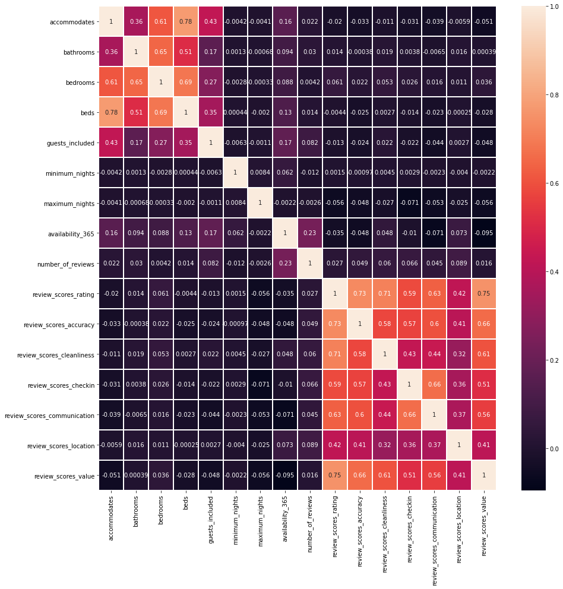


```python
mask = np.triu(np.ones_like(df_numb.corr().abs(), dtype = bool))

df_correlated = df_numb.corr().abs().mask(mask)

```


```python
# No correlation superior to 0.80:
[col for col in df_correlated.columns if any(df_correlated[col] > 0.80)]

```


    []


```python
df_price = df_encoded['price_cleaned']
df_numb = pd.concat([df_numb, df_price], axis=1)
df_encoded.drop(['price_cleaned','security_deposit_cleaned','cleaning_fee_cleaned'], axis=1, inplace=True)

df = pd.concat([df_encoded, df_numb], axis=1)

```


```python
df_numb.columns
```


    Index(['accommodates', 'bathrooms', 'bedrooms', 'beds', 'guests_included',
           'minimum_nights', 'maximum_nights', 'availability_365',
           'number_of_reviews', 'review_scores_rating', 'review_scores_accuracy',
           'review_scores_cleanliness', 'review_scores_checkin',
           'review_scores_communication', 'review_scores_location',
           'review_scores_value', 'price_cleaned'],
          dtype='object')


```python
66900*0.7
```


    46830.0


```python
train = df.sample(frac=0.7)
test = df.loc[46830:]
```


```python
train.shape
```


    (46830, 94)


```python
imputer = KNNImputer()

df_train = pd.DataFrame(imputer.fit_transform(train), columns=train.columns)

df_test = pd.DataFrame(imputer.transform(test), columns=test.columns)


```


```python
for col in df_train[df_numb.columns].columns:
    plt.figure(figsize=(7,7))
    sns.distplot(df_train[col])
    plt.xlabel(f"{col}")
    plt.show()
```


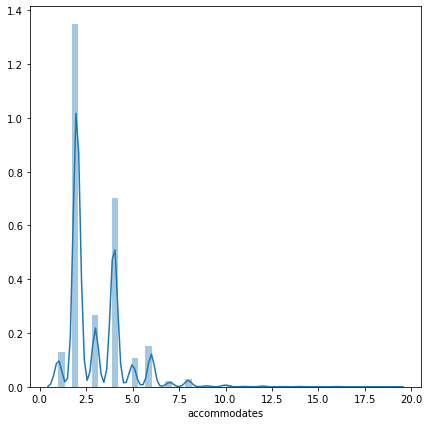


    /home/natsunami/anaconda3/lib/python3.7/site-packages/seaborn/distributions.py:369: UserWarning: Default bandwidth for data is 0; skipping density estimation.
      warnings.warn(msg, UserWarning)


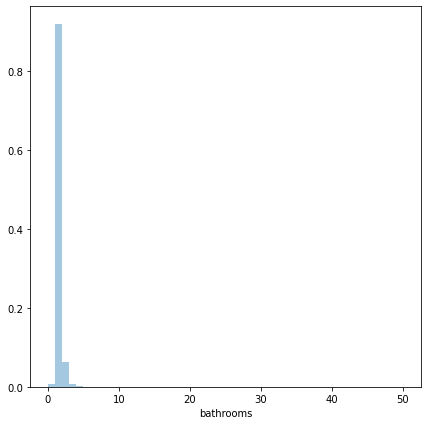


    /home/natsunami/anaconda3/lib/python3.7/site-packages/seaborn/distributions.py:369: UserWarning: Default bandwidth for data is 0; skipping density estimation.
      warnings.warn(msg, UserWarning)


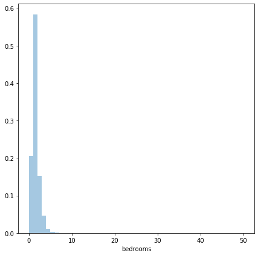


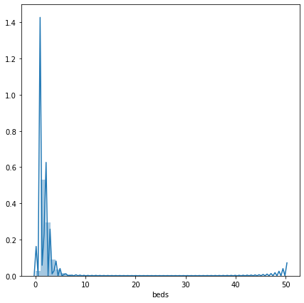


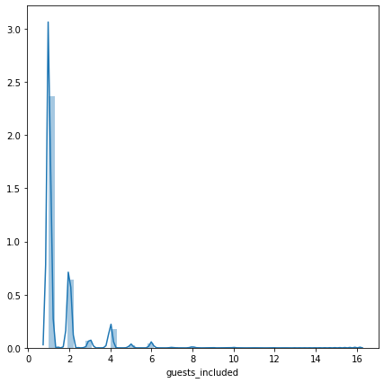


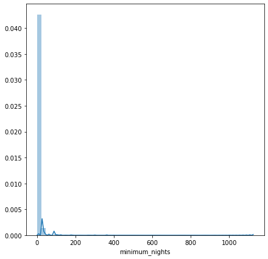


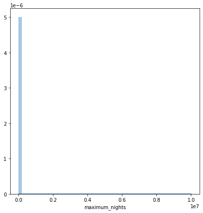


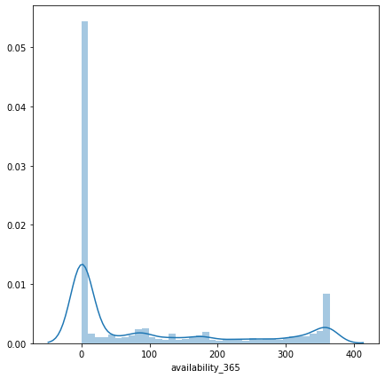


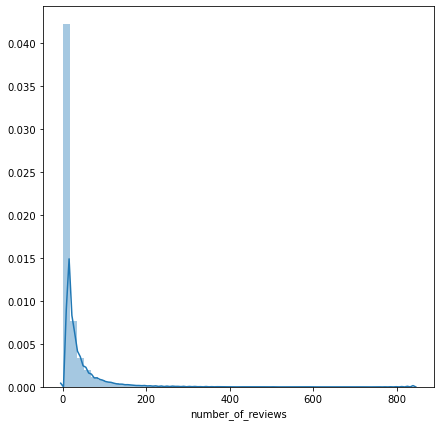


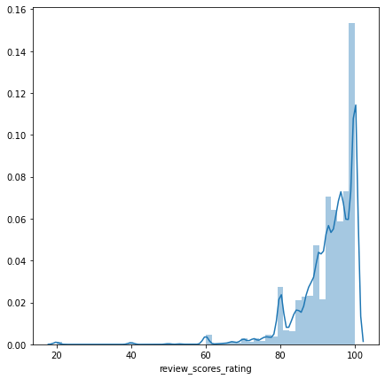


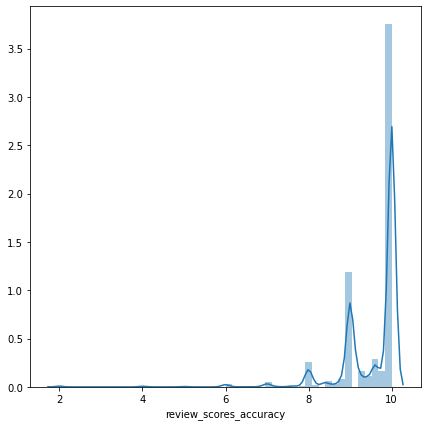


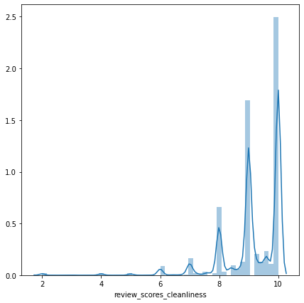


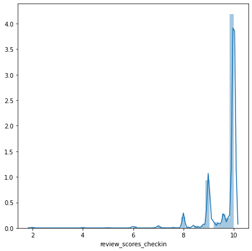


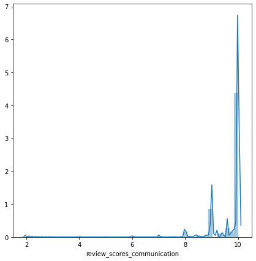


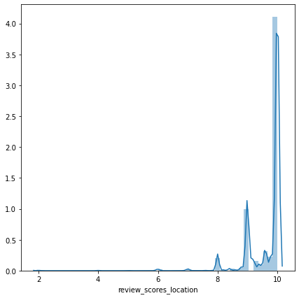


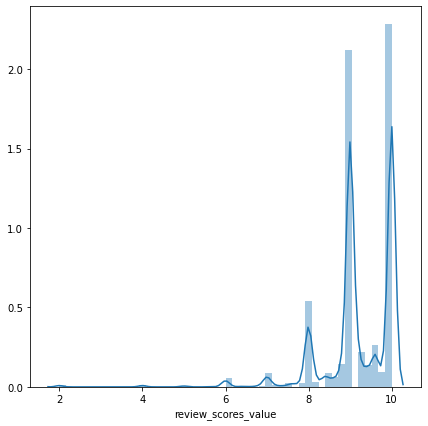


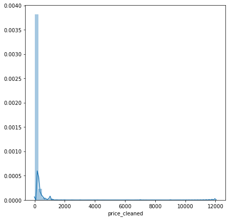


```python

```


```python
df_numb.columns
```


    Index(['accommodates', 'bathrooms', 'bedrooms', 'beds', 'guests_included',
           'minimum_nights', 'maximum_nights', 'availability_365',
           'number_of_reviews', 'review_scores_rating', 'review_scores_accuracy',
           'review_scores_cleanliness', 'review_scores_checkin',
           'review_scores_communication', 'review_scores_location',
           'review_scores_value', 'price_cleaned'],
          dtype='object')


```python
# Outlier detection
for col in df_train[df_numb.columns]:
    
    IQR = df_train[col].quantile(q=0.75) - df_train[col].quantile(q=0.25)
    upper_lim = df_train[col].quantile(q=0.75) + 1.5*IQR
    lower_lim = df_train[col].quantile(q=0.25) - 1.5*IQR
    
    if upper_lim >= df_train[col].max():
        upper_lim = df_train[col].max()
    if lower_lim >= df_train[col].min():
        lower_lim = df_train[col].min() 
    
    df_train = df_train[np.logical_and(df_train[col] <= upper_lim, df_train[col] >= lower_lim)]
    

 

    

    
```


```python
df_train.shape
```


    (23909, 94)


```python
for col in df_test[df_numb.columns]:
    
    IQR = df_train[col].quantile(q=0.75) - df_train[col].quantile(q=0.25)
    upper_lim = df_train[col].quantile(q=0.75) + 1.5*IQR
    lower_lim = df_train[col].quantile(q=0.25) - 1.5*IQR
    
    if upper_lim >= df_test[col].max():
        upper_lim = df_test[col].max()
    if lower_lim >= df_test[col].min():
        lower_lim = df_test[col].min() 
    
    df_test = df_test[np.logical_and(df_test[col] <= upper_lim, df_test[col] >= lower_lim)]
```


```python
dict(df_train.isna().sum())
```


    {'host_is_superhost_bool': 0,
     'instant_bookable_bool': 0,
     'host_neighbourhood_Bastille': 0,
     'host_neighbourhood_Batignolles': 0,
     'host_neighbourhood_Buttes-Chaumont - Belleville': 0,
     'host_neighbourhood_Châtelet - Les Halles - Beaubourg': 0,
     'host_neighbourhood_Commerce - Dupleix': 0,
     "host_neighbourhood_Gare du Nord - Gare de I'Est": 0,
     'host_neighbourhood_II Arrondissement': 0,
     'host_neighbourhood_La Chapelle': 0,
     'host_neighbourhood_La Villette': 0,
     'host_neighbourhood_Le Marais': 0,
     'host_neighbourhood_Montmartre': 0,
     'host_neighbourhood_Nation': 0,
     'host_neighbourhood_Other': 0,
     'host_neighbourhood_Passy': 0,
     'host_neighbourhood_Pigalle - Saint-Georges': 0,
     "host_neighbourhood_Place d'Italie - Quartier Chinois": 0,
     'host_neighbourhood_Porte de Clignancourt': 0,
     'host_neighbourhood_Porte de Versailles': 0,
     'host_neighbourhood_Père Lachaise - Ménilmontant': 0,
     'host_neighbourhood_République': 0,
     'host_neighbourhood_Saint-Germain-des-Prés - Odéon': 0,
     'host_neighbourhood_Tour Eiffel - Champ de Mars': 0,
     'host_neighbourhood_XI Arrondissement': 0,
     'zipcode_75002': 0,
     'zipcode_75003': 0,
     'zipcode_75004': 0,
     'zipcode_75005': 0,
     'zipcode_75006': 0,
     'zipcode_75007': 0,
     'zipcode_75008': 0,
     'zipcode_75009': 0,
     'zipcode_75010': 0,
     'zipcode_75011': 0,
     'zipcode_75012': 0,
     'zipcode_75013': 0,
     'zipcode_75014': 0,
     'zipcode_75015': 0,
     'zipcode_75016': 0,
     'zipcode_75017': 0,
     'zipcode_75018': 0,
     'zipcode_75019': 0,
     'zipcode_75020': 0,
     'zipcode_75116': 0,
     'zipcode_Other': 0,
     'property_type_Apartment': 0,
     'property_type_Bed and breakfast': 0,
     'property_type_Boat': 0,
     'property_type_Boutique hotel': 0,
     'property_type_Condominium': 0,
     'property_type_Guest suite': 0,
     'property_type_Guesthouse': 0,
     'property_type_Hostel': 0,
     'property_type_Hotel': 0,
     'property_type_House': 0,
     'property_type_Loft': 0,
     'property_type_Other': 0,
     'property_type_Rare_type': 0,
     'property_type_Serviced apartment': 0,
     'property_type_Tiny house': 0,
     'property_type_Townhouse': 0,
     'property_type_Villa': 0,
     'room_type_Hotel room': 0,
     'room_type_Private room': 0,
     'room_type_Shared room': 0,
     'bed_type_Couch': 0,
     'bed_type_Futon': 0,
     'bed_type_Pull-out Sofa': 0,
     'bed_type_Real Bed': 0,
     'cancellation_policy_luxury_moderate': 0,
     'cancellation_policy_luxury_super_strict_95': 0,
     'cancellation_policy_moderate': 0,
     'cancellation_policy_strict': 0,
     'cancellation_policy_strict_14_with_grace_period': 0,
     'cancellation_policy_super_strict_30': 0,
     'cancellation_policy_super_strict_60': 0,
     'accommodates': 0,
     'bathrooms': 0,
     'bedrooms': 0,
     'beds': 0,
     'guests_included': 0,
     'minimum_nights': 0,
     'maximum_nights': 0,
     'availability_365': 0,
     'number_of_reviews': 0,
     'review_scores_rating': 0,
     'review_scores_accuracy': 0,
     'review_scores_cleanliness': 0,
     'review_scores_checkin': 0,
     'review_scores_communication': 0,
     'review_scores_location': 0,
     'review_scores_value': 0,
     'price_cleaned': 0}


```python
# Power Transform
scaler = PowerTransformer()

df_train_scaled = pd.DataFrame(scaler.fit_transform(df_train), columns=df_train.columns)
df_test_scaled = pd.DataFrame(scaler.transform(df_test), columns=df_test.columns)
        

```

    /home/natsunami/anaconda3/lib/python3.7/site-packages/sklearn/preprocessing/_data.py:2995: RuntimeWarning: divide by zero encountered in log
      loglike = -n_samples / 2 * np.log(x_trans.var())


```python

```


```python
#df_train_scaled['price_cleaned']
```


    0       -0.572017
    1       -0.838250
    2        1.326971
    3       -0.205816
    4       -0.445904
               ...   
    23904    0.963149
    23905    0.933892
    23906   -1.126374
    23907    1.049773
    23908   -0.404807
    Name: price_cleaned, Length: 23909, dtype: float64


```python
df_train_cat = df_train[df_encoded.columns]
df_train_num_scaled  = df_train_scaled[df_numb.columns]

df_test_cat = df_test[df_encoded.columns]
df_test_num_scaled  = df_test_scaled[df_numb.columns]
```


```python
df_train_final = pd.concat([df_train_cat.reset_index(), df_train_num_scaled.reset_index()], axis=1)
df_test_final = pd.concat([df_test_cat.reset_index(), df_test_num_scaled.reset_index()], axis=1)
```


```python
df_train_final = df_train_final.drop(['index'], axis=1)
df_test_final = df_test_final.drop(['index'], axis=1)
```


```python
 !pwd
```

    /home/natsunami/vivadata-student/curriculum/04-Supervised-Machine-Learning/05-Data-Preparation/01-Challenges/02-Airbnb-Preparation/src


```python
df_train_final.to_csv("/home/natsunami/vivadata-student/curriculum/04-Supervised-Machine-Learning/05-Data-Preparation/01-Challenges/02-Airbnb-Preparation/src/df_train.csv",index=False)
df_test_final.to_csv("/home/natsunami/vivadata-student/curriculum/04-Supervised-Machine-Learning/05-Data-Preparation/01-Challenges/02-Airbnb-Preparation/src/df_test.csv", index=False)

```


```python
df_train_final = pd.read_csv('df_train.csv')
df_test_final = pd.read_csv('df_test.csv')
```


```python
#Train test split:
X_train, X_test, y_train, y_test = df_train_final.drop(['price_cleaned'], axis=1), df_test_final.drop(['price_cleaned'], axis=1), df_train_final['price_cleaned'], df_test_final['price_cleaned']
```


```python
X_train.shape, X_test.shape, y_train.shape, y_test.shape
```


    ((23909, 93), (6838, 93), (23909,), (6838,))


```python
from sklearn.feature_selection import RFECV, RFE
from sklearn.linear_model import LinearRegression, Lasso
from sklearn.decomposition import PCA
from sklearn.pipeline import Pipeline
from sklearn.model_selection import RepeatedKFold
from sklearn.model_selection import cross_val_score
from sklearn.neighbors import KNeighborsRegressor
from sklearn.ensemble import RandomForestRegressor
from sklearn.model_selection import GridSearchCV
```


```python
#Baseline evaluation model with a Multilinear Regression: The model is Underfitting.
lr = LinearRegression()

lr.fit(X_train, y_train)
y_pred_base = lr.predict(X_train)
r2 = r2_score(y_train, y_pred_base)
print(r2)
print(cross_val_score(lr, X_train,y_train,scoring='r2', cv=10))
```

    0.42906205838152134
    [0.45947718 0.45345959 0.43333183 0.40652688 0.4121717  0.414548
     0.39309468 0.39515098 0.43482719 0.42700051]


```python
# Baseline Knn regression perform worst than a linear model
knn_r = KNeighborsRegressor()

knn_r.fit(X_train, y_train)
y_pred_base = knn_r.predict(X_train)
r2 = r2_score(y_train, y_pred_base)
print(r2)
print(cross_val_score(knn_r, X_train,y_train,scoring='r2', cv=10))

```

    0.5147438988375213
    [0.30033899 0.27565492 0.28951054 0.23249435 0.25011118 0.27477006
     0.25920035 0.23330475 0.26584717 0.2593412 ]


```python
# Baseline Random Forest regression: The model is fitting but is clearly overfitting. Time to remove some useless information and hyperparametrize the random forest
rand_for_r = RandomForestRegressor(n_jobs=-1)

rand_for_r.fit(X_train, y_train)
y_pred_forest = rand_for_r.predict(X_train)
r2 = r2_score(y_train, y_pred_forest)
print(r2)
print(cross_val_score(rand_for_r, X_train,y_train,scoring='r2', cv=10))
```

    0.9175088330629233
    [0.43688452 0.44518667 0.41375303 0.40891532 0.40383474 0.42597478
     0.37835484 0.37872854 0.40731609 0.41688313]


```python
random_forest_3 = RandomForestRegressor()

parameters = { 'max_depth':np.arange(1,30),'max_features':np.arange(2,10),'n_estimators':[500,1000,1500],'min_samples_leaf': [10,50,100,200,500]}

random_grid = GridSearchCV(random_forest_3, parameters, cv = 5, n_jobs=-1)
random_grid.fit(X_train, y_train)
```


    ---------------------------------------------------------------------------

    KeyboardInterrupt                         Traceback (most recent call last)

    <ipython-input-212-2852e0982054> in <module>
          4 
          5 random_grid = GridSearchCV(random_forest_3, parameters, cv = 5, n_jobs=-1)
    ----> 6 random_grid.fit(X_train, y_train)
    

    ~/anaconda3/lib/python3.7/site-packages/sklearn/utils/validation.py in inner_f(*args, **kwargs)
         71                           FutureWarning)
         72         kwargs.update({k: arg for k, arg in zip(sig.parameters, args)})
    ---> 73         return f(**kwargs)
         74     return inner_f
         75 


    ~/anaconda3/lib/python3.7/site-packages/sklearn/model_selection/_search.py in fit(self, X, y, groups, **fit_params)
        734                 return results
        735 
    --> 736             self._run_search(evaluate_candidates)
        737 
        738         # For multi-metric evaluation, store the best_index_, best_params_ and


    ~/anaconda3/lib/python3.7/site-packages/sklearn/model_selection/_search.py in _run_search(self, evaluate_candidates)
       1186     def _run_search(self, evaluate_candidates):
       1187         """Search all candidates in param_grid"""
    -> 1188         evaluate_candidates(ParameterGrid(self.param_grid))
       1189 
       1190 


    ~/anaconda3/lib/python3.7/site-packages/sklearn/model_selection/_search.py in evaluate_candidates(candidate_params)
        713                                for parameters, (train, test)
        714                                in product(candidate_params,
    --> 715                                           cv.split(X, y, groups)))
        716 
        717                 if len(out) < 1:


    ~/anaconda3/lib/python3.7/site-packages/joblib/parallel.py in __call__(self, iterable)
       1040 
       1041             with self._backend.retrieval_context():
    -> 1042                 self.retrieve()
       1043             # Make sure that we get a last message telling us we are done
       1044             elapsed_time = time.time() - self._start_time


    ~/anaconda3/lib/python3.7/site-packages/joblib/parallel.py in retrieve(self)
        919             try:
        920                 if getattr(self._backend, 'supports_timeout', False):
    --> 921                     self._output.extend(job.get(timeout=self.timeout))
        922                 else:
        923                     self._output.extend(job.get())


    ~/anaconda3/lib/python3.7/site-packages/joblib/_parallel_backends.py in wrap_future_result(future, timeout)
        540         AsyncResults.get from multiprocessing."""
        541         try:
    --> 542             return future.result(timeout=timeout)
        543         except CfTimeoutError as e:
        544             raise TimeoutError from e


    ~/anaconda3/lib/python3.7/concurrent/futures/_base.py in result(self, timeout)
        428                 return self.__get_result()
        429 
    --> 430             self._condition.wait(timeout)
        431 
        432             if self._state in [CANCELLED, CANCELLED_AND_NOTIFIED]:


    ~/anaconda3/lib/python3.7/threading.py in wait(self, timeout)
        294         try:    # restore state no matter what (e.g., KeyboardInterrupt)
        295             if timeout is None:
    --> 296                 waiter.acquire()
        297                 gotit = True
        298             else:


    KeyboardInterrupt: 


```python
random_grid.best_params_, random_grid.best_score_
```


    ({'max_features': 9, 'min_samples_leaf': 10, 'n_estimators': 500},
     0.38699736454071615)


```python
# RFE to disminish the curse of dimensionality:
forest_rfe= RandomForestRegressor(n_jobs=-1)

selector = RFECV(forest_rfe, step=10, cv=5, n_jobs=-1, min_features_to_select= 30)
selector = selector.fit(X_train, y_train)

```


```python
#RFE mask to apply on DataFrame:
mask_rfe = selector.support_
mask_rfe
```


    array([ True,  True,  True,  True,  True,  True,  True,  True,  True,
            True,  True,  True,  True,  True,  True,  True,  True,  True,
            True,  True,  True,  True,  True,  True,  True,  True,  True,
            True,  True,  True,  True,  True,  True,  True,  True,  True,
            True,  True,  True,  True,  True,  True,  True,  True,  True,
            True,  True, False, False,  True,  True, False, False, False,
            True, False, False, False, False, False, False, False, False,
            True,  True,  True, False, False,  True,  True, False, False,
            True, False,  True, False, False,  True,  True,  True,  True,
            True,  True,  True,  True,  True,  True,  True,  True,  True,
            True,  True,  True])


```python
#Define a variance threshold:
X_train = X_train.loc[:,mask_rfe]
X_test = X_test.loc[:,mask_rfe]


```


```python
X_train.loc[:,X_train.var() > 0.03].columns
```


    Index(['host_is_superhost_bool', 'instant_bookable_bool',
           'host_neighbourhood_Batignolles',
           'host_neighbourhood_Buttes-Chaumont - Belleville',
           'host_neighbourhood_Montmartre', 'host_neighbourhood_Other',
           'host_neighbourhood_République', 'host_neighbourhood_XI Arrondissement',
           'zipcode_75003', 'zipcode_75009', 'zipcode_75010', 'zipcode_75011',
           'zipcode_75012', 'zipcode_75013', 'zipcode_75014', 'zipcode_75015',
           'zipcode_75017', 'zipcode_75018', 'zipcode_75019', 'zipcode_75020',
           'property_type_Apartment', 'room_type_Private room',
           'bed_type_Pull-out Sofa', 'bed_type_Real Bed',
           'cancellation_policy_moderate',
           'cancellation_policy_strict_14_with_grace_period', 'accommodates',
           'bathrooms', 'bedrooms', 'beds', 'guests_included', 'minimum_nights',
           'maximum_nights', 'availability_365', 'number_of_reviews',
           'review_scores_rating', 'review_scores_accuracy',
           'review_scores_cleanliness', 'review_scores_checkin',
           'review_scores_communication', 'review_scores_location',
           'review_scores_value'],
          dtype='object')


```python
sel = VarianceThreshold(threshold=0.03)

# Fit the selector to normalized head_df
sel.fit(X_train)

# Create a boolean mask
mask = sel.get_support()
```


```python
X_train = X_train.loc[:,mask]
X_test = X_test.loc[:,mask]
```


```python
X = pd.concat([X_train,X_test], axis=0)
```


```python
pca = PCA(n_components=17)

X_pca = pca.fit_transform(X)

```


```python
pca.explained_variance_ratio_.cumsum()
```


    array([0.20399185, 0.34657322, 0.42237134, 0.48701837, 0.54276096,
           0.5915482 , 0.63770147, 0.68050885, 0.72029229, 0.75936615,
           0.79367841, 0.81803565, 0.84081809, 0.86315923, 0.88475309,
           0.89966086, 0.91219105])


```python
X_df_pca = pd.DataFrame(X_pca)
```


```python

X_train = X_df_pca.loc[X_train.index]
X_test = X_df_pca.loc[X_test.index]
```


```python
random_forest_reg_pca = RandomForestRegressor(n_jobs=-1)

random_forest_reg_pca.fit(X_train, y_train)
y_pred_forest = random_forest_reg_pca.predict(X_train)
r2 = r2_score(y_train, y_pred_forest)
print(r2)
print(cross_val_score(random_forest_reg_pca, X_train,y_train,scoring='r2', cv=5))
```

    0.9012039513683381
    [0.32058752 0.2970388  0.29364767 0.27990295 0.30062677]


```python
random_forest_3 = RandomForestRegressor(n_jobs=-1)

parameters = { 'max_features':np.arange(5,10),'n_estimators':[500],'min_samples_leaf': [10,50,100,200,500]}

random_grid = GridSearchCV(random_forest_3, parameters, cv = 5, )
random_grid.fit(X_train, y_train)
```


    GridSearchCV(cv=5, estimator=RandomForestRegressor(n_jobs=-1),
                 param_grid={'max_features': array([5, 6, 7, 8, 9]),
                             'min_samples_leaf': [10, 50, 100, 200, 500],
                             'n_estimators': [500]})


```python
random_grid.best_params_
```


    {'max_features': 9, 'min_samples_leaf': 10, 'n_estimators': 500}


```python
random_grid.best_score_
```


    0.31051122746949156


```python

```
